[Sci Calc](https://jacksummerfield1.github.io/calculator-project-2/) is simply a scientific calculator, available to perform simple and more advanced mathematical techniques, ranging from trigonometric to logarithmic functions to squares and roots etc.

## Table of Contents

- [UX](#ux)
- [Installation](#installation)
- [Usage](#usage)
- [Technologies Used](#technologies-used)
- [Features](#features)
- [Testing](#testing)
- [Deployment](#deployment)
- [Credits](#credits)

## UX

### Goals

#### Visitor Goals

The target audience for Sci Calc are:

- Individuals with a passion for mathematics
- People who are problem solvers
- People who want to advance their math knowledge
- People that need help with their math homework

#### User Goals

- View and use a range of different mathematical functions
- Interact with the calculator itself
- Store previous answers for future use in other expressions
- Get some insight on how a calculator works and the correct techniques that should be used

These are fulfilled by:

- Offering a wide variety of different functions
- Providing an interactive keypad alongside different techniques used to evaluate expressions
- Providing a store and recall memory system, where answers can be re-used for more complicated questions

### User Stories

1. As a user, I want to perform basic arithmetic operations (such as addition, subtraction, division and multiplication)
2. As a user, I want to clear my current calculation so that I can start a new calculation from scratch
3. As a user, I want to perform advanced mathematical functions (such as square root, exponents, logarithms)
4. As a user, I want to use trigonometric functions (sine, cosine, tangent)
5. As a user, I want to input multi-digit numbers and decimal points so that I can perform more precise calculatiosn
6. As a user, I want to use memory functions so that I can store and recall previous calculations
7. As a user, I want to see error messages for invalid operations
8. As a user, I want the calculator to respond quickly

#### Icons

- Icons are taken from the [FontAwesome](https://fontawesome.com/) Icon Library and are utilised as classes in the <i> tag.

#### Colors


- I wanted the site to follow a minimal aesthetic, the colors I have used have an excellent contrast ratio to the white text, maximising the user experience.

- The text is primarily white to contrast the bold color backgrounds

## Installation

### Prerequisites

- Node.js
- npm

### Steps

```bash
git clone https://github.com/JackSummerfield1/calculator-project-2.git
cd JackSummerfield1
npm install

```

## Usage

### How to Run

```bash
npm start
```

## Technologies Used

### Languages

- [HTML](https://www.w3.org/html/)
  - Page markup
- [CSS](https://www.w3.org/Style/CSS/Overview.en.html)
  - Styling
- [JavaScript](https://www.javascript.com/)
  - Scripting

### Libraries

- [FontAwesome](https://fontawesome.com/)
  - Used for icons

### Platforms

- [Github](https://github.com/)
  - Storing code remotely and deployment.
- [Gitpod](https://gitpod.io/)
  - IDE for project development.

### Other Tools

- [Favicon Generator](https://favicon.io/)

  - Creating Favicons

- [Coolors](https://coolors.co/)

  - Creating color pallettes

- [Canva](https://www.canva.com/)

  - Creating background

- [Color Identifier](https://imagecolorpicker.com/en)

  - Finding unknown colors on images

- [ChatGPT](https://chat.openai.com/)
  - Help debug some code

## Features

- Feature 1:
  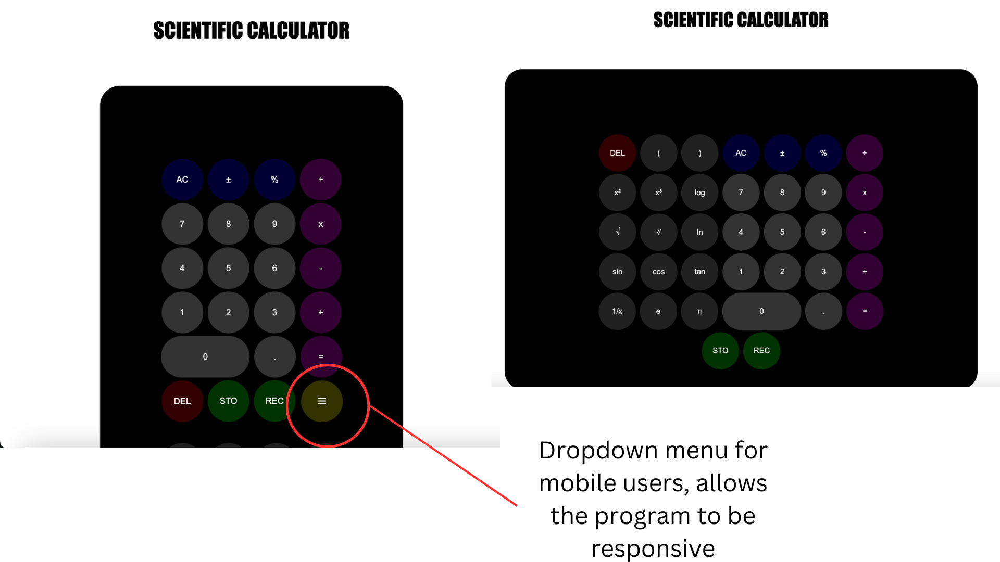
  - I have incorporated a dropdown menu for mobile users, including all of the more scientific mathematical functions. This allows for a better user experience and lets them choose whether or not they want to access those functions
- Feature 2:
  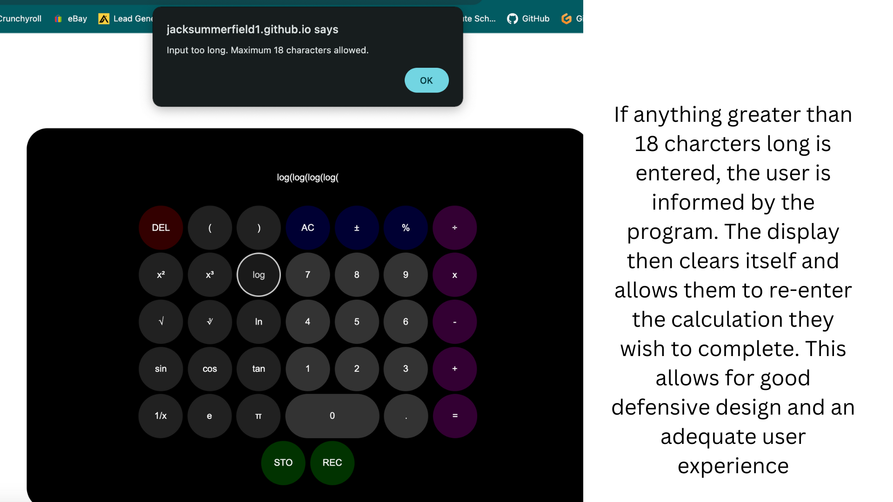
  - I have created an error system to help with defensive design. This stops the user from entering anything more than 18 characters and resets the screen if this occurs, along with an error message explaining what the user has done wrong.
- Feature 3:
  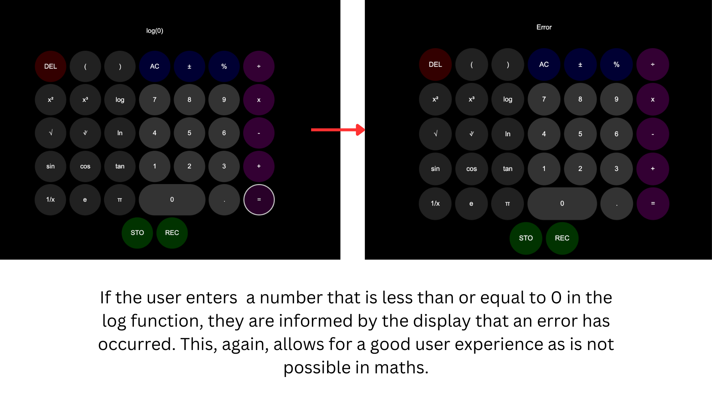
  - I have created an error system with the log function, where values less than or equal to 0 cannot be entered. As this breaks mathematical laws, hence, an error message is displayed to the user.
- Feature 4:
  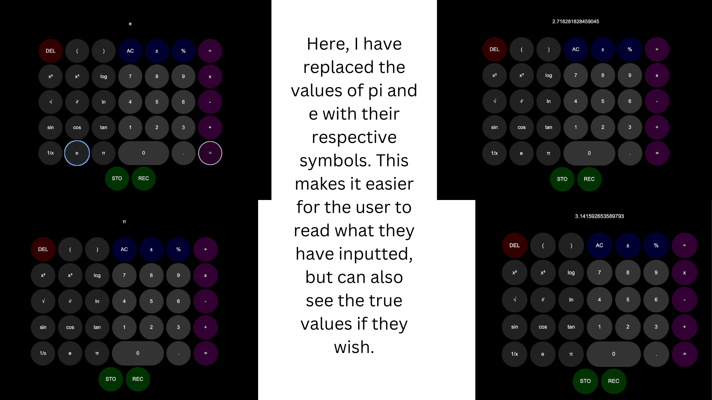
  - The values of e and pi have been replaced by their respective mathematical symbols to allow for a better user experience.
- Feature 5:
  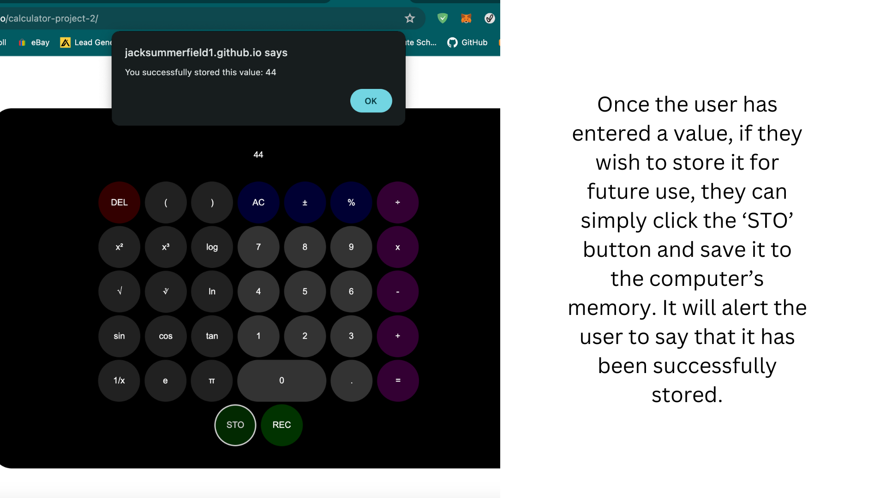
  - Use of a store button so that the user can save previous values to a memory.
- Feature 6:
  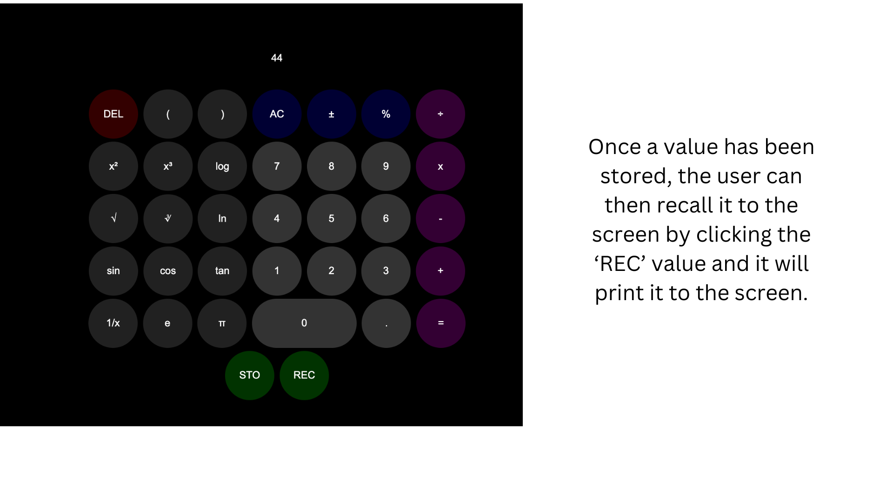
  - Use of a recall button so that the user can re-use previous values they have stored to the memory.

## Testing

### Methods

#### Validation

- HTML has been validated with [W3C HTML5 Validator:](https://validator.w3.org/)
  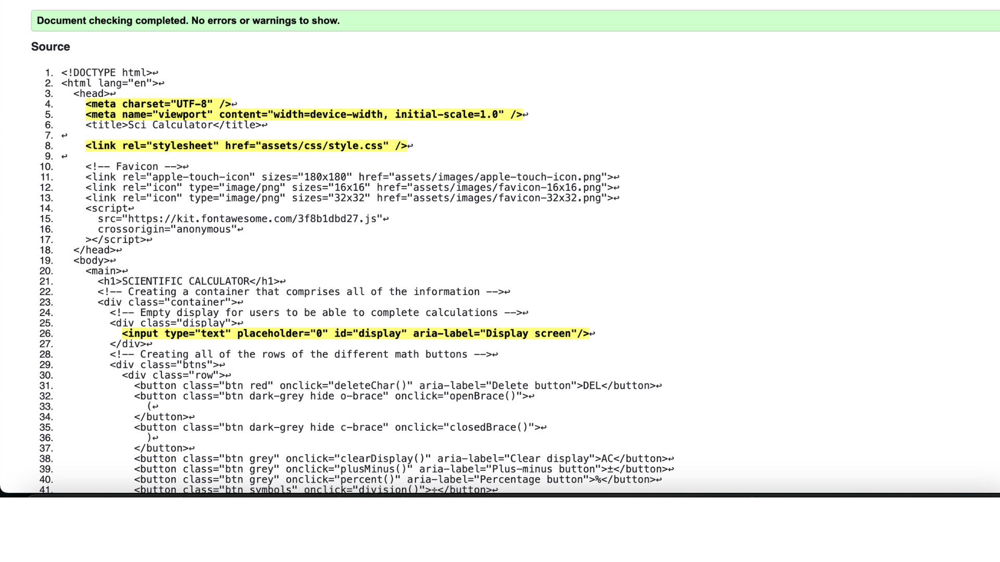
- CSS has been validated with [W3C CSS Validator](https://jigsaw.w3.org/css-validator/)
  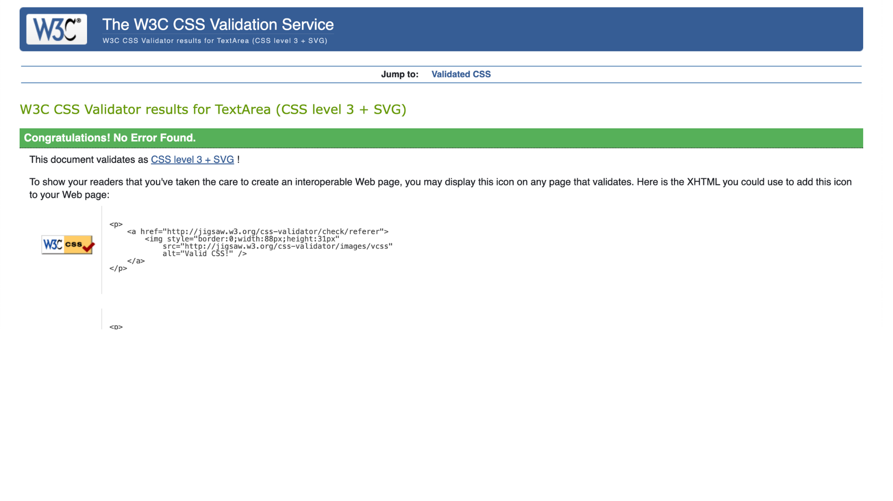
- JS has been validated with [JSHint Validator](https://jshint.com/), no errors shown but there are 42 warnings.
  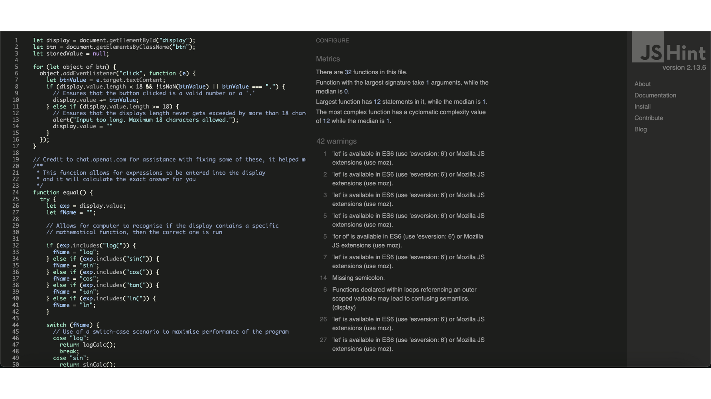
- Code has passed the [WAVE Accessibility Evaluation Tool:](https://wave.webaim.org/report#/https://jacksummerfield1.github.io/calculator-project-2/)
  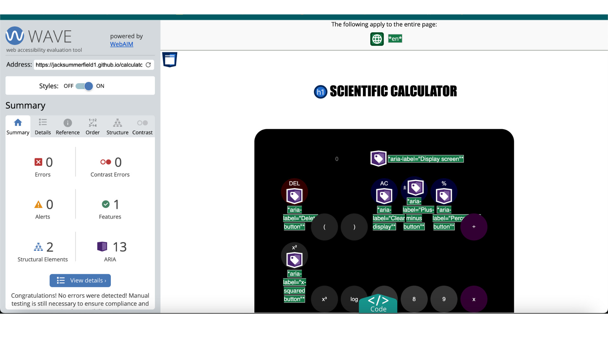

#### General Testing

- .gitignore file is included to prevent system file commits.

#### Mobile Testing

- I tested the site personally on my iPhone device, checking all buttons were working as expected, no issues were found. However, I have not been able to test on Android devices
- The site was sent to close family for them to follow the same process and check everything was in working order.
- Chrome was used to inspect the site in mobile format

#### Desktop Testing

- The site was developed on a Windows PC and all testing occurred via Google Chrome
- The site was tested by a few close friends on numerous devices including Macbooks.
- The site has not been tested with Internet Explorer, keeping in mind that support for the browser is gradually decreasing.

### Bugs

#### Fixed Bugs

- Content inside of brackets in a function ie. log(7+3) or cos(10\*2.5) was not working correctly, prior to it being fixed, the PC would evaluate the first number ie. log(7) or cos(10).
- To fix this, instead of parseFloat() the content inside the brackets, I changed it to eval(), which fixed the issue.

#### Known Bugs

- The calculator cannot perform advanced technqiues such as 5*log(2), in this case it will only calculate log(2) and forget about the 5*.

- The calculator evaluates 1/0 as infinity, however this is mathematically incorrect. 1/0 would evaluate to undefined.

- The display only recognises when 18 or more characters have been inputted through clicking the buttons, if you type more than 18 characters, it will not display an error message to the user.

### Lighthouse Statistics

<table>
    <tr>
        <th>Pagespeed Insights (Mobile)</th>
        <th>Pagespeed Insights (Desktop)</th>
        <th>Link for proof (Mobile)</th>
        <th>Link for proof (Desktop)</th>
    </tr>
    <tr>
        <th>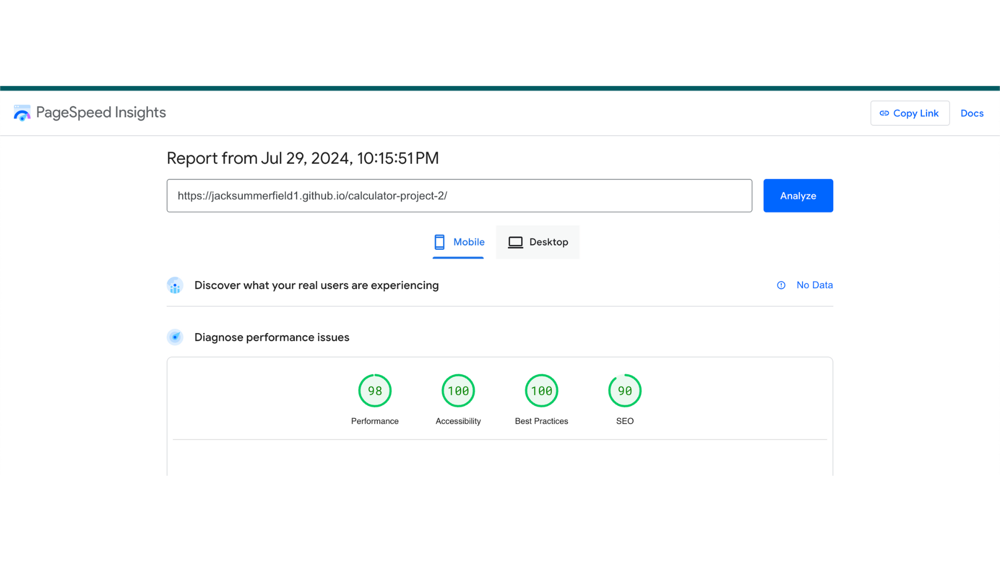</th>
        <th>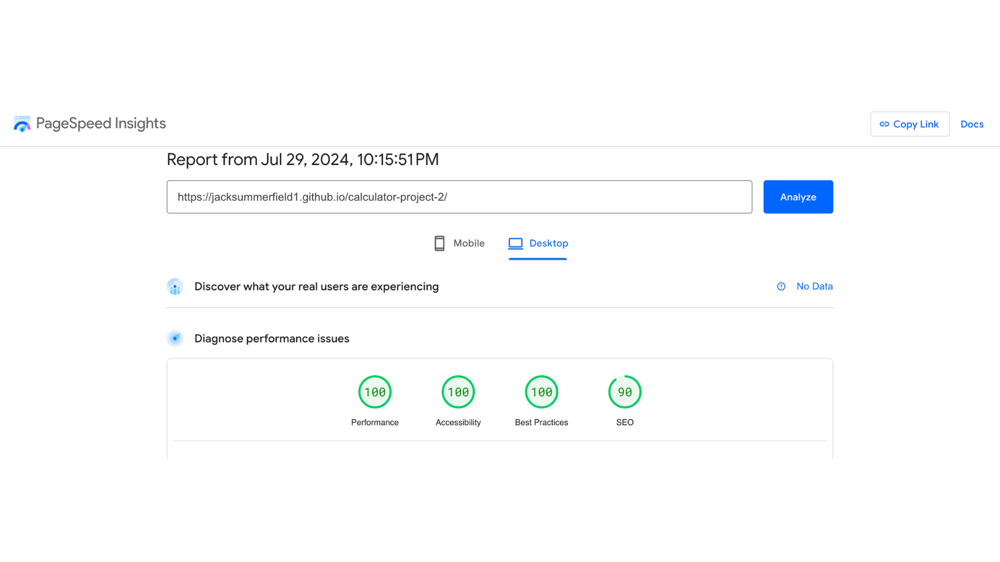</th>
        <th><a href="https://pagespeed.web.dev/analysis/https-jacksummerfield1-github-io-calculator-project-2/ph03aepctx?form_factor=mobile">Click Here</a></th>
        <th><a href="https://pagespeed.web.dev/analysis/https-jacksummerfield1-github-io-calculator-project-2/ph03aepctx?form_factor=desktop">Click Here</a></th>
    </tr>
</table>

## Deployment

### Github Deployment

#### Github Preparation

- A free github account

#### Github Instructions

1.  Log in to your GitHub account, navigate to [https://github.com/JackSummerfield1/calculator-project-2]
2.  You can set up your own repository and copy or clone it, or you fork the repository.
3.  git add, git commit and git push to a GitHub repository, if necessary.
4.  GitHub pages will update from the master branch by default.
5.  Go to **Settings** page of the repository.
6.  Scroll down to the **GitHub Pages** section.
7.  Select the Master Branch as the source and **Confirm** the selection.
8.  Wait a minute or two and it should be live for viewing. See my own [here](https://jacksummerfield1.github.io/calculator-project-2/)

## Credits

### Debugging

- If I got stuck with code that wasn't working as expected I would use [ChatGPT](https://chatgpt.com/) to assist me with where I was going wrong, I have specified with comments in my code when I used it.

- I also got a lot of help from online forums and [W3Schools](https://www.w3schools.com/) when trying to understand different JS techniques. Again, this has been commented and specified within my code.

### Contact

Please feel free to contact me at **summerzj10@gmail.com**
